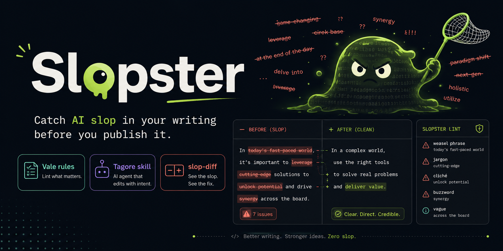

<p align="center">
  
</p>

# Slopster

Catch AI slop in your writing before you publish it.

Slopster is a collection of lint rules, an AI coding agent skill, and a diff tool that detect the patterns that make AI-assisted writing obvious: negation pivots, inflated jargon, filler words, em dash abuse, and the phrases that make readers' eyes glaze over.

## What's in the box

**Vale lint rules** (works immediately, no AI needed)
Five YAML rules that plug into [Vale](https://vale.sh), the open-source prose linter. Run `vale your-file.md` and get line-by-line feedback:

| Rule | What it catches | Level |
|------|----------------|-------|
| `AISlop` | Negation-then-correction patterns (`X isn't Y. It's Z.`), filler openers (`In today's...`) | Warning |
| `BannedWords` | 30+ phrases that scream AI: `game-changer`, `unleash`, `paradigm shift`, `Let that sink in` | Error |
| `JargonSwaps` | 25+ word substitutions: `utilize` -> `use`, `leverage` -> `use`, `facilitate` -> `help` | Error |
| `WeakWords` | Filler and hedge words: `very`, `basically`, `furthermore`, `at its core` | Warning |
| `EmDash` | More than 3 em dashes per document (LLMs overuse them) | Warning |

**[Tagore](https://github.com/apurvrdx1/tagore) skill** (for Claude Code, Codex, Cursor, Windsurf, and other AI coding agents)
A 29-pattern detection catalog combined with an 8-dimension scoring rubric. Goes deeper than lint: it scores prose on directness, rhythm, trust, authenticity, density, specificity, restraint, and voice. Fails anything below 56/80. Built from [humanizer](https://github.com/blader/humanizer) by blader and [stop-slop](https://github.com/hardikpandya/stop-slop) by Hardik Pandya.

**slop-diff** (CI/branch-level detection)
A TypeScript script that compares your branch against main and reports only *new* slop findings. Ignores line-number shifts so refactoring doesn't create false positives. Requires [Bun](https://bun.sh) and [slop-scan](https://www.npmjs.com/package/slop-scan).

## Quick start

### Vale rules (recommended starting point)

```bash
# Install Vale (https://vale.sh/docs/install), then:
git clone https://github.com/t0ddharris/slopster.git
cp -r slopster/styles your-project/
cp slopster/.vale.ini your-project/   # or merge with your existing .vale.ini
vale your-file.md
```

### Tagore skill (AI coding agents)

```bash
# Claude Code
cp -r slopster/skills/tagore ~/.claude/skills/

# Codex
cp -r slopster/skills/tagore ~/.codex/skills/
```

Then ask your agent to "run tagore on this draft."

### slop-diff (CI integration)

```bash
npm i -g slop-scan    # one-time dependency
bun run /path/to/slopster/tools/slop-diff.ts          # diff against main
bun run /path/to/slopster/tools/slop-diff.ts develop   # diff against another branch
```

## Customization

### Add your own banned words

Edit `styles/Slopster/BannedWords.yml` and add tokens to the list:

```yaml
tokens:
  # ... existing entries ...
  - "synergize"
  - "move the needle"
  - "circle back"
```

### Add jargon swaps

Edit `styles/Slopster/JargonSwaps.yml`:

```yaml
swap:
  # ... existing entries ...
  operationalize: run
  incentivize: motivate
```

### Adjust em dash limit

Edit `styles/Slopster/EmDash.yml` and change `max`:

```yaml
max: 5  # or whatever you prefer
```

### Add approved vocabulary

Add industry terms to `styles/config/vocabularies/Slopster/accept.txt` (one per line) so Vale doesn't flag them:

```
YAML
CLI
DevOps
```

### Define your voice

Copy `templates/voice.md` into your project and fill it in. If you're using the Tagore skill, point it at your voice file for calibration:

> "Humanize this text. Use my writing style from voice.md as a reference."

## How the layers work together

The Vale rules and the Tagore skill solve different problems and work best in sequence:

1. **Write or generate your draft** (with whatever tools you use)
2. **Run Tagore** (if using an AI agent) for deep rewriting: pattern removal, voice injection, 8-dimension scoring
3. **Run Vale** as the deterministic safety net: catches anything Tagore missed with zero subjectivity
4. **Run slop-diff on PRs** to gate new slop from entering your repo

Vale catches the mechanical stuff (banned words, jargon, em dashes). Tagore catches the structural stuff (metronomic rhythm, narrator-from-a-distance voice, soulless-but-clean prose). Neither one alone is enough.

## Credits

**[Tagore](https://github.com/apurvrdx1/tagore)** is an independent skill that Slopster bundles. It's built from two open-source projects:

- **[humanizer](https://github.com/blader/humanizer)** by blader — 29-pattern catalog of AI writing tells, based on [Wikipedia:Signs of AI writing](https://en.wikipedia.org/wiki/Wikipedia:Signs_of_AI_writing) (WikiProject AI Cleanup)
- **[stop-slop](https://github.com/hardikpandya/stop-slop)** by Hardik Pandya — 8 core principles, 12-item pre-delivery checklist, and the 1-10 scoring rubric

The Vale rules and slop-diff tool are original to this project.

## License

MIT
